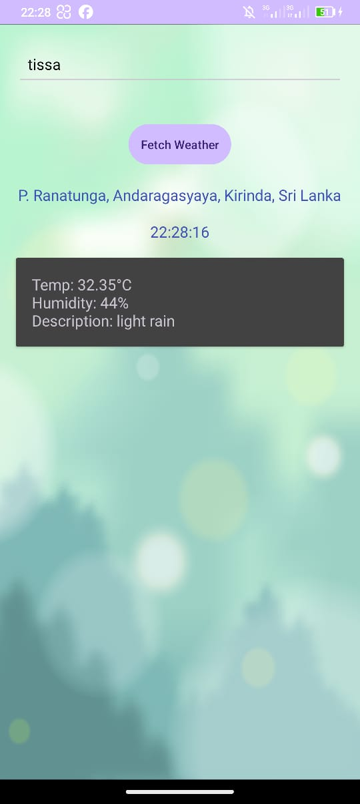

<h1>WeatherApp Extend Version</h1>
<p>WeatherApp is an Android application that allows users to view current weather information for their current location or a city of their choice. The app provides details such as temperature, humidity, and weather description.
Features</p>

  - ***Current Location Weather: Automatically fetches and displays the weather information for the user's current location.***
  - ***City Weather Search: Allows users to enter a city name and fetch the weather information for that city.***
  - ***Geocoded Address: Displays the geocoded address of the current location.***
  - ***Current System Time: Shows the current system time.***
  - ***Weather Information: Displays temperature, humidity, and weather description.***

<h2>Screenshots</h2>




<h2>Requirements</h2>
  
  - **Android Studio**
  - **Physical Android device or emulator**
  - **OpenWeatherMap API key**

<h2>Installation</h2>

1. Clone the repository:
   

```sh
    git clone https://github.com/yourusername/WeatherApp.git
```

2. Open the project in Android Studio.
   

3. Add your OpenWeatherMap API key:
   
    - **Replace YOUR_API_KEY in MainActivity.java with your actual OpenWeatherMap API key.**

<h2>Usage</h2>

1. Run the app on an emulator or physical device.
2. Grant location permissions when prompted.
3. Fetch current location weather:
     - **The app will automatically fetch and display the weather for your current location.**
4. Search for a city weather:
     - **Enter a city name in the EditText and click the "Fetch Weather" button to get the weather information for the specified city.**
    
    
        
    

<h2>Data Persistence</h2>

The app saves the last searched city name using SharedPreferences and loads it when the app starts, allowing for a seamless user experience.

<h2>Networking</h2>

The app uses Retrofit to fetch weather data from the OpenWeatherMap API, handling network operations asynchronously to ensure a smooth user interface.

<h2>Testing</h2>

Ensure the app runs successfully on both an emulator and a physical device. Make sure to grant all necessary permissions and test the app's functionality by searching for weather information for different cities and checking the current location weather feature.
